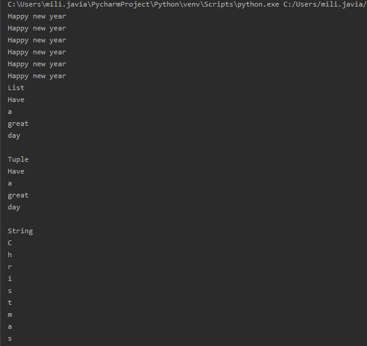

## Loops in python

1.While Loop: In python, while loop is used to execute a block of statements repeatedly until a given a condition is satisfied. And when the condition becomes false, the line immediately after the loop in program is executed.

2.For Loop: For loops are used for sequential traversal. For example: traversing a list or string or array etc. In Python, there is no C style for loop, i.e., for (i=0; i<n; i++). There is “for in” loop which is similar to for each loop in other languages.

3.Iterating by index of sequences: We can also use the index of elements in the sequence to iterate. The key idea is to first calculate the length of the list and in iterate over the sequence within the range of this length.

4.Using else statement with for loops: We can also combine else statement with for loop like in while loop. But as there is no condition in for loop based on which the execution will terminate so the else block will be executed immediately after for block finishes execution.

5.Nested Loops: Python programming language allows to use one loop inside another loop.

for iterator_var in sequence: for iterator_var in sequence: statements(s) statements(s)

## Loop Control Statements: 

Loop control statements change execution from its normal sequence. When execution leaves a scope, all automatic objects that were created in that scope are destroyed. Python supports the following control statements.

- Continue Statement: It returns the control to the beginning of the loop.

- Break Statement: It brings control out of the loop

- Pass Statement: We use pass statement to write empty loops. Pass is also used for empty control statement, function and classes.

## Break and Continue in Python

- Break():
The break statement in Python terminates the current loop and resumes execution at the next statement, just like the traditional break found in C.

The most common use for break is when some external condition is triggered requiring a hasty exit from a loop. The break statement can be used in both while and for loops.

- Continue():
The continue statement in Python returns the control to the beginning of the while loop. The continue statement rejects all the remaining statements in the current iteration of the loop and moves the control back to the top of the loop.

The continue statement can be used in both while and for loops.

## Conditions

Python supports to have an else statement associated with a loop statements.

- If the else statement is used with a for loop, the else statement is executed when the loop has exhausted iterating the list.

- If the else statement is used with a while loop, the else statement is executed when the condition becomes false.

- ELIF
>a = 10

>b = 32

>if b > a:

>  print("b is greater than a")

>elif a == b:

>  print("a and b are equal")

- ELIF with else
>a = 10

>b = 32

>if b > a:

>  print("b is greater than a")

>elif a == b:

>  print("a and b are equal")

>else:

>  print("a is greater than b")

- Modules in python:

What is a Module?
Consider a module to be the same as a code library.

A file containing a set of functions you want to include in your application.

!
