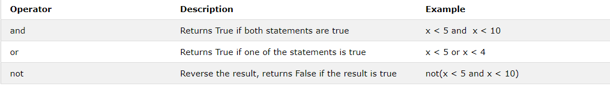
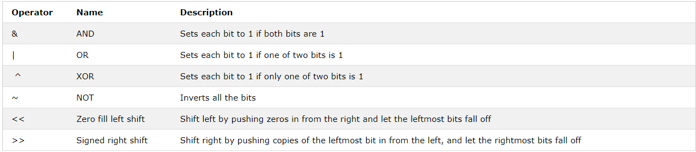
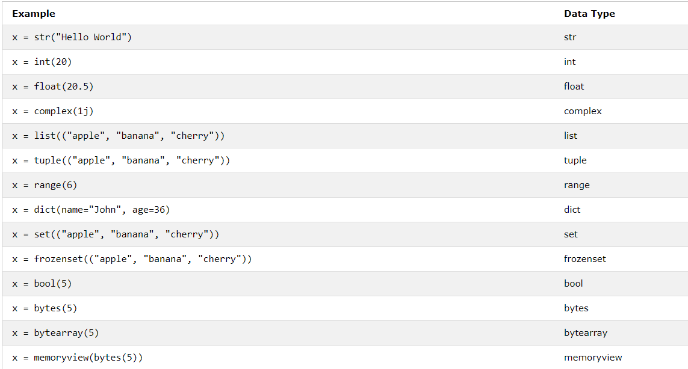

   # Python

**Introduction**

Python is a general-purpose interpreted, interactive, object-oriented, and high-level programming language. 
It was created by Guido van Rossum during 1985- 1990. Like Perl, Python source code is also available under 
the GNU General Public License (GPL). This tutorial gives enough understanding on Python programming language.

Python is a high-level, interpreted, interactive and object-oriented scripting language. Python is designed to
be highly readable. It uses English keywords frequently where as other languages use punctuation, and it has fewer 
syntactical constructions than other languages.

Python is a MUST for students and working professionals to become a great Software Engineer specially when they are
working in Web Development Domain. Some of the key advantages of learning Python are:

1. Python is Interpreted − Python is processed at runtime by the interpreter. You do not need to compile your program 
before executing it. This is similar to PERL and PHP.

2. Python is Interactive − You can actually sit at a Python prompt and interact with the interpreter directly to write your programs.

3. Python is Object-Oriented − Python supports Object-Oriented style or technique of programming that encapsulates code within objects.

4. Python is a Beginner's Language − Python is a great language for the beginner-level programmers and supports the development of a wide range of applications from simple text processing to WWW browsers to games.

**Characteristics of Python:**

- It supports functional and structured programming methods as well as OOP.

- It can be used as a scripting language or can be compiled to byte-code for building large applications.

- It provides very high-level dynamic data types and supports dynamic type checking.

- It supports automatic garbage collection.

- It can be easily integrated with C, C++, COM, ActiveX, CORBA, and Java.

**Features of python:**

- Easy-to-learn − Python has few keywords, simple structure, and a clearly defined syntax. This allows the student to pick up the language quickly.

- Easy-to-read − Python code is more clearly defined and visible to the eyes.

- Easy-to-maintain − Python's source code is fairly easy-to-maintain.

- A broad standard library − Python's bulk of the library is very portable and cross-platform compatible on UNIX, Windows, and Macintosh.

- Interactive Mode − Python has support for an interactive mode which allows interactive testing and debugging of snippets of code.

- Portable − Python can run on a wide variety of hardware platforms and has the same interface on all platforms.

- Extendable − You can add low-level modules to the Python interpreter. These modules enable programmers to add to or customize their tools to be more efficient.

- Databases − Python provides interfaces to all major commercial databases.

- GUI Programming − Python supports GUI applications that can be created and ported to many system calls, libraries and windows systems, such as Windows MFC, Macintosh, and the X Window system of Unix.

- Scalable − Python provides a better structure and support for large programs than shell scripting.

**Importance:**

- Readable and Maintainable Code
- Multiple Programming Paradigms
- Compatible with Major Platforms and Systems
- Robust Standard Library
- Many Open Source Frameworks and Tools
- Simplify Complex Software Development
- Adopt Test Driven Development

**Python implemetations/Versions:-**

- Cpython:-
The default implementation of the Python programming language is Cpython. As the name suggests Cpython is written in C language. Cpython compiles the python source. 
code into intermediate bytecode, which is executed by the Cpython virtual machine. CPython is distributed with a large standard library written in a mixture of C and Python. 
CPython provides the highest level of compatibility with Python packages and C extension modules. All versions of the Python language are implemented in C because CPython is 
the reference implementation.
Some of the implementations which are based on CPython runtime core but with extended behavior or features in some aspects are Stackless Python, wpython, MicroPython.
Stackless Python – CPython with an emphasis on concurrency using tasklets and channels (used by dspython for the Nintendo DS).

- Jython:-
Jython is an implementation of the Python programming language that can run on the Java platform. Jython programs use Java classes instead of Python modules.
Jython compiles into Java byte code, which can then be run by Java virtual machine. Jython enables the use of Java class library functions from the Python program. 
Jython is slow as compared to Cpython and lacks compatibility with CPython libraries.

- IronPython:-
A Python implementation written in C# targeting Microsoft’s .NET framework. Similar to Jython, it uses .Net Virtual Machine i.e Common Language Runtime. 
IronPython can use the .NET Framework and Python libraries, and other .NET languages can use Python code very efficiently. IronPython performs better in 
Python programs that use threads or multiple cores, as it has a JIT, and also because it doesn’t have the Global Interpreter Lock.

- PyPy:-
“If you want your code to run faster, you should probably just use PyPy.” — Guido van Rossum (creator of Python)
Python is dynamic programming language. Python is said to be slow as the default CPython implementation compiles the python source code in bytecode which is 
slow as compared to machine code(native code). Here PyPy comes in.
PyPy is an implementation of the Python programming language written in Python. The Interpreter is written in RPython (a subset of Python).
PyPy uses (just-in-time compilation). In simple terms JIT uses compilation methods to make interpreter system more efficient and fast. 
So basically JIT makes it possible to compile the source code into native machine code which makes it very fast.
PyPy also comes with default with support for stackless mode, providing micro-threads for massive concurrency. 
Python is said to be approximately 7.5 times faster than Cpython.

**Python Toolchain:-**

Python is an object oriented programming language like Java. Python is called an interpreted language. Python uses code modules that are interchangeable 
instead of a single long list of instructions that was standard for functional programming languages. The standard implementation of python is called “cpython”. 
It is the default and widely used implementation of the Python.Python doesn’t convert its code into machine code, something that hardware can understand. 
It actually converts it into something called byte code. So within python, compilation happens, but it’s just not into a machine language. 
It is into byte code and this byte code can’t be understood by CPU. So we need actually an interpreter called the python virtual machine. 
The python virtual machine executes the byte codes.

- Step 1 : The interpreter reads a python code or instruction. Then it verifies that the instruction is well formatted, i.e. it checks the syntax of each line.
If it encounters any error, it immediately halts the translation and shows an error message.
- Step 2 : If there is no error, i.e. if the python instruction or code is well formatted then the interpreter translates it into its equivalent form in intermediate 
language called “Byte code”.Thus, after successful execution of Python script or code, it is completely translated into Byte code.
- Step 3 : Byte code is sent to the Python Virtual Machine(PVM).Here again the byte code is executed on PVM.If an error occurs during this execution then the execution 
is halted with an error message.

**Command Line Arguments:-**

The command line arguments in python can be processed by using either ‘sys’ module or ‘argparse’ module.

###### Example 1:-
>import sys 
>argumentList = sys.argv 
 
>print argumentList 
   
>print sys.argv[0] 
 
>print sys.argv[1] 

###### Exmaple 2:-
>import sys 

>from math import factorial 
  
>print factorial(int(sys.argv[1]))

**Taking input in Python:-**

   Developers often have a need to interact with users, either to get data or to provide some sort of result. Most programs today use a dialog box as a way of asking the user to provide some type of input. While Python provides us with two inbuilt functions to read the input from the keyboard.

raw_input ( prompt )
input ( prompt )

g = raw_input("Enter your name : ") 

print g 

###### Output:

###### Enter your name :Mili Javia

Input( ): 

This function first takes the input from the user and then evaluates the expression, which means Python automatically identifies whether user entered a string or a number or list. If the input provided is not correct then either syntax error or exception is raised by python.

num = input ("Enter number :") 
print(num) 
name1 = input("Enter name : ") 
print(name1) 
  
###### Printing type of input value: 

print ("type of number", type(num)) 

print ("type of name", type(name1)) 

###### Output:
>Enter number : 1505

>Enter name : Mili Javia

>Mili Javia

>typeofnumber<class 'str'>

>typeofname<class 'str'>

**Output in python:-**

print("VeryGoodMorning") 

x = 12
###### Two objects are passed: 
print("x =", x) 
  
###### Code for disabling the softspace feature:  
print('V', 'G', 'M', sep ='') 
  
###### Using end argument: 
print("Person", end = '@')   

print("VeryGoodMorning")  

###### Output:
>VeryGoodMorning

>x = 12

>VGM

>Person@VeryGoodMorning

**Operators in Python**

###### Python Arithmetic Operators

###### Python Assignment Operators

###### Python Comparison Operators

###### Python Logical Operators

###### Python Identity Operators

###### Python Membership Operators

###### Python Bitwise Operators

**Python Data Types**

###### Built-in Data Types

- Text Type:	str

- Numeric Types:	int, float, complex

- Sequence Types:	list, tuple, range

- Mapping Type:	dict

- Set Types:	set, frozenset

- Boolean Type:	bool

- Binary Types:	bytes, bytearray, memoryview

###### Getting the Data Type

>x = 5
>print(type(x))

###### Setting the Data Type

###### Setting the Specific Data Type

**List in Python**

###### Python Collections (Arrays)
There are four collection data types in the Python programming language:

- List is a collection which is ordered and changeable. Allows duplicate members.
- Tuple is a collection which is ordered and unchangeable. Allows duplicate members.
- Set is a collection which is unordered and unindexed. No duplicate members.
- Dictionary is a collection which is unordered, changeable and indexed. No duplicate members.

###### List
A list is a collection which is ordered and changeable. In Python lists are written with square brackets.

> alist = ["raspberry", "blueberry", "strawberry"]
> print(alist)

###### Access Items
You access the list items by referring to the index number:

> alist = ["raspberry", "blueberry", "strawberry"]
> print(alist[2])

###### Negative Indexing
Negative indexing means beginning from the end, -1 refers to the last item, -2 refers to the second last item etc.

###### Range of Indexes
You can specify a range of indexes by specifying where to start and where to end the range.

When specifying a range, the return value will be a new list with the specified items.

> alist = ["raspberry", "cherry", "orange","strawberry", "kiwi","blueberry", "mango"]

> print(alist[1:4])

This example returns the items from the beginning to "strawberry"

> print(alist[:4])

This example returns the items from index -5 (included) to index -2 (excluded):-

> print(alist[-5:-2])

###### Change Item Value
To change the value of a specific item, refer to the index number:

>alist = ["orange", "apricot", "jackfruit"]

>alist[1] = "blackberry"

>print(alist)

###### Loop through a list

>alist = ["orange", "apricot", "jackfruit"]

>for x in alist:

>print(x)

###### Check if Item Exists

>alist = ["orange", "apricot", "jackfruit"]

>if "apple" in alist:

>print("Yes, 'apricot' is in the fruits list")
  
###### List Length

>alist = ["orange", "apricot", "jackfruit"]

>print(len(alist)

###### Add Items

> alist = ["orange", "apricot", "jackfruit"]

> alist.append("cherry")

> print(alist)

###### Other methods in List

**Dynamic input in List**

**Tuples in Python**

###### Tuple

A tuple is a collection which is ordered and unchangeable. In Python tuples are written with round brackets.

**Set**

A set is a collection which is unordered and unindexed. In Python sets are written with curly brackets.

>set = {"apple", "banana", "cherry"}

>print(set)

